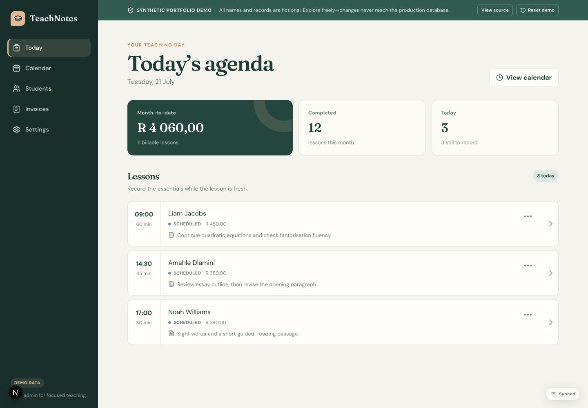
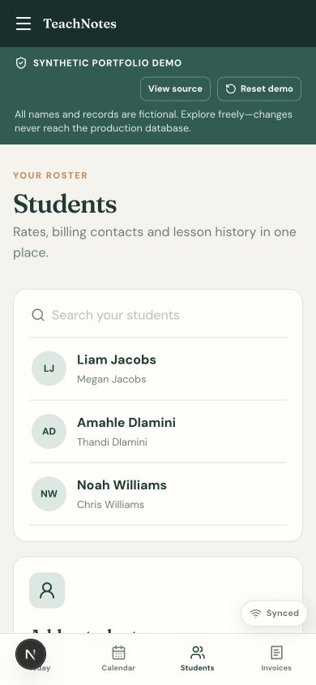
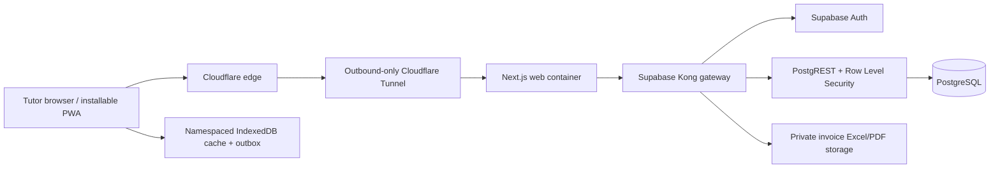

# TeachNotes

[](https://github.com/dantheman24mac/teachnotes/actions/workflows/ci.yml)
[](https://github.com/dantheman24mac/teachnotes/actions/workflows/codeql.yml)
[](LICENSE)

TeachNotes is an offline-friendly lesson, attendance, student and invoice manager for an independent tutor. It uses Next.js 16, TypeScript, Supabase and Docker. The production target is a Raspberry Pi behind Cloudflare Tunnel.

- **Live application:** [teachnotes.fyi](https://teachnotes.fyi)
- **Synthetic-data demo:** [demo.teachnotes.fyi](https://demo.teachnotes.fyi)

The demo runs in its own container without a Supabase URL, service key or route to production data. Every displayed identity and financial record is fictional.



<p align="center"></p>

## What is included

- Email/password signup with server-side Supabase sessions and administrator approval.
- Pending and rejected accounts remain isolated by application checks and database RLS.
- Today agenda with quick attendance and note capture.
- IndexedDB lesson cache, offline outbox, idempotent sync and visible conflict resolution.
- Student-specific fixed duration/price defaults and future-lesson updates.
- Weekly and fortnightly recurring series, multiple weekdays, exclusions, open-ended rolling materialization and one/following/all-future rescheduling.
- Consolidated and per-student monthly invoice previews, immutable invoice snapshots, private Excel workbooks with PDFs converted from those workbooks, void-and-regenerate behavior and double-billing protection.
- Row Level Security on every user-owned database table and private invoice storage.
- Responsive desktop/mobile UI, installable web manifest, neutral offline shell, unit tests and browser workflow tests.

## Start locally

Prerequisites: Node.js 22+, npm and Docker Desktop.

```bash
npm install
npm run supabase:start
npm run env:local
npm run auth:create-owner
npm run dev
```

The setup commands download the local Supabase images, apply migrations and create `.env.local`. Local Auth uses Cloudflare's always-pass Turnstile test keys, so no real CAPTCHA secret is required for development. The owner command prompts for a password without storing it in the environment file, creates the configured backing email when necessary, and idempotently promotes it to the sole protected administrator.

New users sign up with an email and password and are signed in immediately because email autoconfirm is enabled. Their account remains pending and has no access to tutor data until the administrator approves it. Email addresses are identifiers only: TeachNotes does not verify ownership or send approval, rejection, or password-reset email.

The development services are:

- App: <http://localhost:3000>
- Supabase API: <http://localhost:54321>

After the owner exists, `npm run dev:up` can start the complete containerized development environment. Stop everything with:

```bash
npm run dev:down
```

For fast UI work without authentication or a running backend, stop Supabase, remove `.env.local`, and run `npm run dev`; TeachNotes will use representative demo data.

## Development commands

```bash
npm run dev          # Next.js development server
npm run build        # production standalone build
npm run lint         # ESLint
npm test             # pricing and recurrence unit tests
npm run test:e2e     # desktop/mobile browser workflows
npm run db:reset     # rebuild local database from migrations
npm run env:local    # refresh .env.local from Supabase status
npm run auth:create-owner # find-or-create and promote the protected administrator
npm run auth:reset-owner  # recover the protected administrator password
```

## Architecture notes



- Server Components query Supabase directly; browser HTTP endpoints are reserved for delta sync, paginated history and private PDF downloads.
- Authenticated pages and API responses are private and uncached. Approval is checked in the application and in RLS; a valid session alone does not grant tutor-data access. Static assets use Next.js immutable caching.
- The service worker never caches authenticated HTML. It serves a user-neutral offline shell that hydrates only from the active account's namespaced IndexedDB, which is the authoritative device-side cache for lessons, conflicts and queued edits.
- Lesson changes carry an operation UUID and base version. The PostgreSQL sync function locks each row, deduplicates retries and returns a conflict instead of overwriting another edit.
- Money is stored in integer cents and each lesson snapshots a fixed amount. Duration changes never prorate the amount automatically.
- A partial unique database index prevents one lesson from appearing in two active finalized invoices.

## Security design

- Production secrets remain in mode-`600` files on the Pi and are never Docker build arguments or `NEXT_PUBLIC_*` values.
- The database, connection pooler and API gateway bind only to loopback; Cloudflare Tunnel is the only Internet ingress.
- Application approval checks and PostgreSQL Row Level Security both enforce workspace isolation.
- Invoice Excel and PDF objects are private and scoped to the authenticated owner. Existing legacy PDFs remain unchanged; new files are generated from finalized snapshots.
- A nonce-based Content Security Policy, HSTS, clickjacking protection, MIME sniffing protection and a restrictive Permissions Policy are applied at the web layer.
- CI runs linting, type checks, unit tests and a production build. CodeQL, Dependabot, GitGuardian and GitHub secret scanning cover the public repository.

See [Security architecture](docs/security-architecture.md) for the trust boundaries, demo isolation and reporting process. Please report vulnerabilities privately using [GitHub Security Advisories](https://github.com/dantheman24mac/teachnotes/security/advisories/new), not a public issue.

## Raspberry Pi production

The root `Dockerfile` produces a non-root ARM64-compatible Next.js standalone server with `/api/health` and headless LibreOffice Calc for invoice conversion. It pins Alpine 3.23 and includes Writer's small shared registry dependency because Alpine's split Calc package cannot initialize headlessly without it. The Pi deployment runs the official self-hosted Supabase Docker stack and joins its Kong gateway to a private `teachnotes` Docker network. Cloudflare Tunnel publishes only the Next.js app and Supabase API hostnames; no inbound router or database ports are opened.

See [deploy/pi/README.md](deploy/pi/README.md) for the topology, environment templates, startup sequence and local backup procedure. Railway remains a compatible later option because the web container is stateless and continues to use standard Supabase URLs.

The public demo is built from the same commit but runs as a separate `demo` service on an isolated Docker network. It receives no production environment file and serves only the synthetic records in `src/lib/demo-data.ts`.

## Contributing and licence

Contributions are welcome. Read [CONTRIBUTING.md](CONTRIBUTING.md) before opening a pull request and [SECURITY.md](SECURITY.md) before reporting a vulnerability.

TeachNotes is available under the [MIT License](LICENSE).
